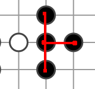

# <a href="https://en.wikipedia.org/wiki/Go_(game)">Go</a> over WebSocket

Go is an ancient game that involves two players competing on a grid for space.
The goal is to surround the largest amount of area. See the above Wikipedia
article for more information.

I started this project for three reasons:

 1. I like the game of Go
 2. Playing it requires a board and a bunch of stones (web is better than real life)
 3. I wanted to learn the HTML5 Canvas and WebSocket APIs

I started thinking about reason 3 during a talk at Cascadia Ruby conference in Portland,
the speakers were showing off a WebSocket-based chat app that the audience was participating
in.

TODO:

 - [ ] Implement Pair, Set, Graph
 - [x] hook up graph North,South,East,West edges on Board.putPiece
 - [ ] implement Breadth-First Search to identify connected components
 - [ ] define libertiesCount() function to count the liberties of a component
 - [ ] add scoring rules to program
 - [ ] save state in localStorage
 - [ ] add clear board button
 - [ ] hook up a WebSocket (before this, learn how to WebSocket)

# Data Structures

The board is represented using a 2D array of `Vertex` objects, each of which
has a `color` property.

The `color` defaults to `null`, but can be switched to `black` or `white`.

Each vertex has up to four edges, which can connect to adjacent vertices of the
same color. This defines an implicit graph.

Using the implicit graph, a `ComponentMap` object is used to find the connected 
components, then expose an iterator that visits each component once.

# Algorithms

There is a wrapper around the board and the vertices, it is the `Board` object,
the most involved of the methods is `putPiece`, that fires when a user clicks
on a spot on the board.

_Steps in italics have yet to be implemented_

When the user clicks on a spot on the board, the following things happen:

 1. The mouse coordinates are rounded to the nearest intersection on the board.
    This is done with the `Board.pointToIndex` method.
 2. If the vertex at the nearest intersection is colored `null`, then the
    it is set to `Board.currentColor`.
 3. If any of the four neighbors (North, West, South or East) are the same
    color, edges are added to include the new vertex in the connected component
    of similarly colored pieces.
 4. _The connected components are found using a Breadth-First Search_
 5. _For each connected component, if there are no liberties (empty spots on the
     boundary) the component will be deleted, and all the colors set to `null`._
