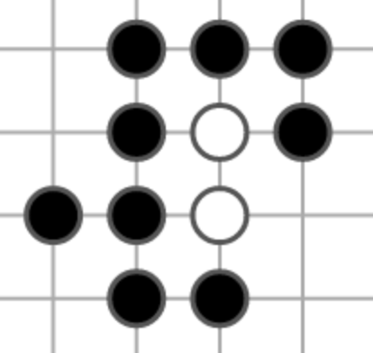

# Breadth-First Search

**Input**: An unweighted graph and a start vertex u

**Idea**:

 - Maintain a set R of vertices that have been reached but not searched and
 - a set S of vertices that have been searched.
 - The set R is maintained as a First-In First-Out list ([queue](https://en.wikipedia.org/wiki/Queue_%28abstract_data_type%29))

**Initialization**: R = {u}, S = ø, d(u,u) = 0

**Iteration**: As long as R ≠ ø, we search from the first vertex v of R. The neighbors of v not in S⋃R are added to the back of R and assigned distance d(u,v)+1, and then v is removed from the front of R and placed in S.

## Example

Let G be the adjacency graph of the following Go shape: 

Implementing this undirected graph as a digraph gives the following graph: 

We now pick a vertex u

## References
 - West. D. Introduction to Graph Theory (second edition) 2.3.8
